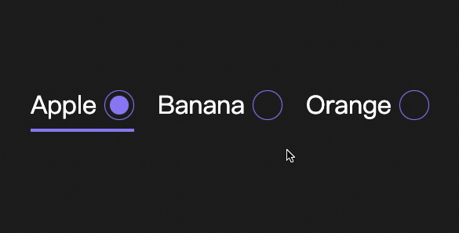
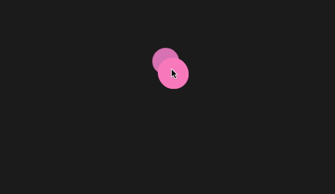
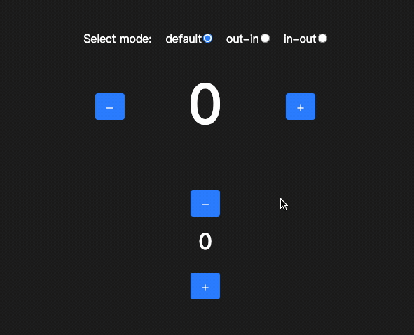
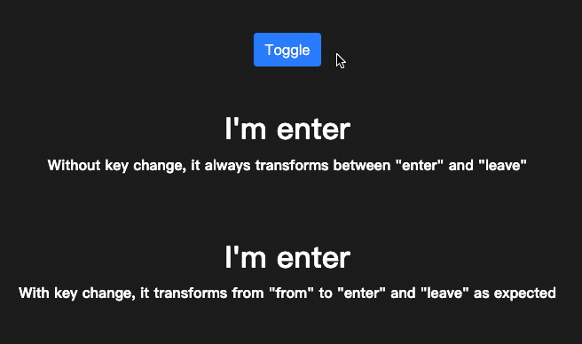

<h1 align="center">☄️ transition-hook</h1>

<p align="center">
  <a href="https://github.com/iamyoki/transition-hook/actions/workflows/test.yml"></a>
  <a href="https://github.com/iamyoki/transition-hook/actions/workflows/release.yml"></a>
  <a href="https://github.com/iamyoki/transition-hook">
    
  </a>
  <a href="https://github.com/iamyoki/transition-hook">
    
  </a>
</p>

<p align="center">An extremely light-weight<strong>(1kb)</strong> react transition animation hook which is simpler and easier to use than <a href="https://github.com/reactjs/react-transition-group" target="_blank">react-transition-group</a></p>
<br>

<p align="center">
  <a href="https://tqgdj.csb.app/">
    
  </a>
  <br>
  <a href="https://tqgdj.csb.app/">See Example</a> |
  <a href="https://codesandbox.io/s/transition-hook-example-tqgdj">See Example in Codesandbox</a>
</p>

<p align="center">
  <a href="https://o3f41.csb.app/ripple-effect">
    
  </a>
  <a href="https://o3f41.csb.app/emoji-switch-transition">
    
  </a>
</p>

<p align="center">
  <a href="https://o3f41.csb.app/radio-transition">
    
  </a>
  <a href="https://o3f41.csb.app/painter">
    
  </a>
</p>

<p align="center">
  <a href="https://o3f41.csb.app/basic">
    
  </a>
  <a href="https://o3f41.csb.app/basic-switch-transition">
    
  </a>
  <a href="https://o3f41.csb.app/transition-with-key">
    
  </a>
</p>

<p align="center">
  <a href="https://codesandbox.io/s/transition-hook-examples-o3f41">See More Examples in Codesandbox</a>
</p>
<br>

- [Installation](#installation)
- [Usage](#usage)
  - [useTransition](#usetransition)
  - [useSwitchTransition](#useswitchtransition)
  - [Transition](#transition)
  - [SwitchTransition](#switchtransition)
- [API Reference](#api-reference)
  - [useTransition(state, timeout)](#usetransitionstate-timeout)
  - [useSwitchTransition(state, timeout, mode)](#useswitchtransitionstate-timeout-mode)
  - [Transition](#transition-1)
  - [SwitchTransition](#switchtransition-1)
- [License](#license)

## Installation

Install with yarn

```bash
yarn add transition-hook
```

Or install with npm

```bash
npm install transition-hook --save
```

## Usage

### useTransition

This hook transforms a boolean state into transition stage('from' | 'enter' | 'leave'), and unmount the component after timeout.

```jsx
const [onOff, setOnOff] = useState(true)
const {stage, shouldMount} = useTransition(onOff, 300) // (state, timeout)

return <div>
  <button onClick={()=>setOnOff(!onOff)}>toggle</button>
  {shouldMount && (
    <p style={{
      transition: '.3s',
      opacity: stage === 'enter' ? 1 : 0
    }}>
      Hey guys, I'm fading
    </p>
  )}
</div>
```

### useSwitchTransition

This hook transforms when the state changes.

```jsx
const [count, setCount] = useState(0)
const transition = useSwitchTransition(count, 300, 'default') // (state, timeout, mode)

return <div>
  <button onClick={()=>setCount(count+1)}>add</button>
  {transition((state, stage)=>(
    <p style={{
      transition: '.3s',
      opacity: stage === 'enter' ? 1 : 0,
      transform: {
        from: 'translateX(-100%)',
        enter: 'translateX(0%)',
        leave: 'translateX(100%)',
      }[stage]
    }}>{state}</p>
  ))}
</div>
```

### Transition

If you prefer FaCC pattern usage, there it is!

```jsx
const [onOff, setOnOff] = useState(true)

return <div>
  <button onClick={()=>setOnOff(!onOff)}>toggle</button>
  <Transition state={onOff} timeout={300}>
    {(stage, shouldMount)=>shouldMount &&(
      <p style={{
        transition: '.3s',
        opacity: stage === 'enter' ? 1 : 0
      }}>
        Hey guys, I'm fading
      </p>
    )}
  </Transition>
</div>
```

### SwitchTransition

FaCC pattern version of useSwitchTransition

```jsx
  <SwitchTransition state={count} timeout={300} mode='default'>
    {(state, stage) => (
      <h1
        style={{
          transition: '.3s',
          opacity: stage === 'enter' ? 1 : 0,
          transform: {
            from: 'translateX(-100%) scale(1.2)',
            enter: 'translateX(0)',
            leave: 'translateX(100%) scale(0)'
          }[stage]
        }}>
        {state} {stage} hello
      </h1>
    )}
  </SwitchTransition>
```

## API Reference

### useTransition(state, timeout)

```js
  const {stage, shouldMount} = useTransition(onOff, 300)
```

| Parameters | Type      | Description                                                           |
| :--------- | :-------- | :-------------------------------------------------------------------- |
| `state`    | `boolean` | **Required**. Your boolean state, which controls animation in and out |
| `timeout`  | `number`  | **Required**. How long before the animation ends and unmounts         |

<br>

| Returns       | Type                                | Description                                         |
| :------------ | :---------------------------------- | :-------------------------------------------------- |
| `stage`       | Stage: `from` \| `enter` \| `leave` | Use three different stage to perform your animation |
| `shouldMount` | `boolean`                           | Whether the component should be mounted             |

### useSwitchTransition(state, timeout, mode)

```js
  const transition = useSwitchTransition(onOff, 300, 'default')
```

| Parameters | Type                              | Description                                                   |
| :--------- | :-------------------------------- | :------------------------------------------------------------ |
| `state`    | `any`                             | **Required**. Your state, which triggers animation            |
| `timeout`  | `number`                          | **Required**. How long before the animation ends and unmounts |
| `mode`     | `default` \| `out-in` \| `in-out` | **Optional**. Default to `default` mode                       |

### Transition

```jsx
  <Transition state={onOff} timeout={300}>
    {(stage, shouldMount) => shouldMount && <div style={{...}}>hello</div>}
  </Transition>
```

| Props      | Type                                                    | Description                                                           |
| :--------- | :------------------------------------------------------ | :-------------------------------------------------------------------- |
| `state`    | `boolean`                                               | **Required**. Your boolean state, which controls animation in and out |
| `timeout`  | `number`                                                | **Required**. How long before the animation ends and unmounts         |
| `children` | `(stage: Stage, shouldMount: boolean)=>React.ReactNode` | **Required**. FaCC pattern.                                           |

### SwitchTransition

```jsx
  <SwitchTransition state={count} timeout={300}>
    {(state, stage) => <div style={{...}}>{state} hello</div>}
  </SwitchTransition>
```

| Props      | Type                                          | Description                                                           |
| :--------- | :-------------------------------------------- | :-------------------------------------------------------------------- |
| `state`    | `any`                                         | **Required**. Your boolean state, which controls animation in and out |
| `timeout`  | `number`                                      | **Required**. How long before the animation ends and unmounts         |
| `mode`     | `default` \| `out-in` \| `in-out`             | **Optional**. Default to `default` mode                               |
| `children` | `(state: any, stage: Stage)=>React.ReactNode` | **Required**. FaCC pattern.                                           |

## License

[MIT](https://choosealicense.com/licenses/mit/)
